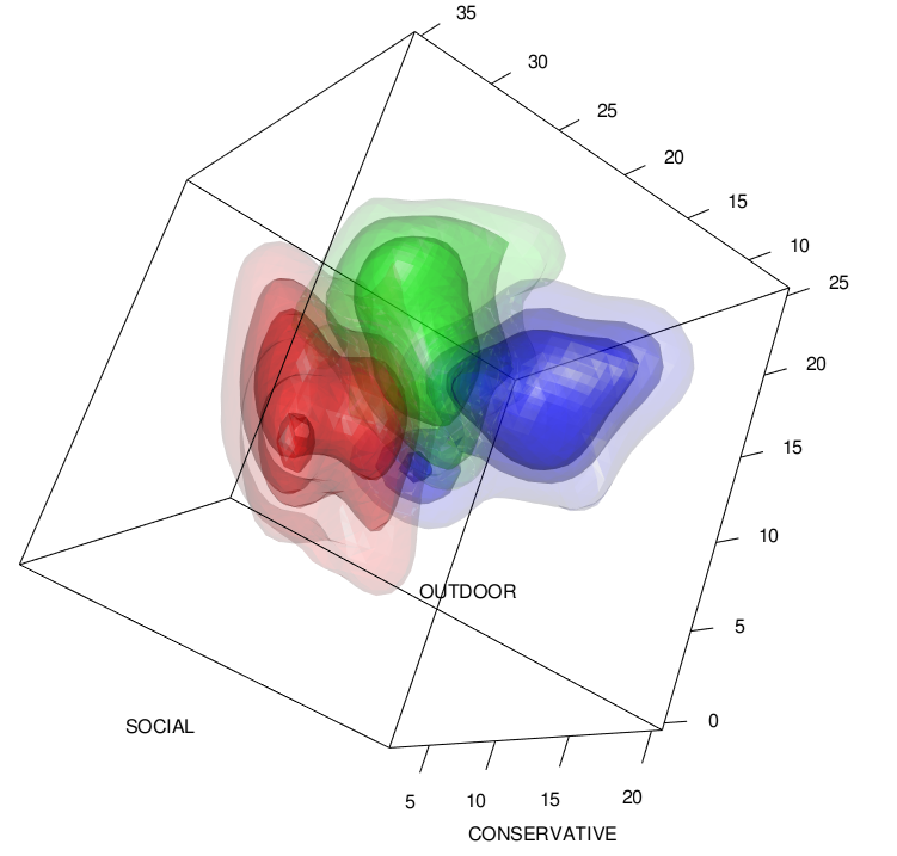

This analysis compares the efficacy of three classifiers in identifying the job title of employees of a large international air carrier, based entirely on three psychological measures. The data consists of psychological measurements for `244` employees related to their (a) level of interest in outdoor activities, (b) sociability, and (c) conservativeness. The aim of the analysis is to classify each employee as holding one of three job titles: (1) customer service personnel, (2) mechanic, or (3) dispatcher, based on the psychological measurements.

As the outcome of interest is categorical by nature, I focused on classification algorithms that are effective at handling multiple classes. The three algorithms I compared included (1) kernel discriminant analysis, (2) k-nearest neighbors, and (3) random forest. The sections that follow take a closer look at the data itself and explore in greater detail the application of the aforementioned classification methods to this problem.

## Exploratory Data Analysis

Prior to constructing any models, I first explored the data in greater detail to identify any nuances that may influence the analysis. One common issue when dealing with classification problems is the presence of an imbalance among the classes, which would require extra care when partitioning the data between a training and test set (e.g., using stratified sampling). As Table 1 demonstrates, there are roughly equal numbers of observations among each class, so class imbalance should not present any issues for this analysis.

```{r, echo=TRUE, message=FALSE, warning=FALSE}

library(dplyr)
library(ggplot2)
library(ks)
library(scatterplot3d)
library(randomForest)
library(caret)
library(xtable)
library(knitr)
library(GGally)

setwd("/Users/jh/Documents/GitHub/kda-knn-randomforest-R")

misClass <- function(pred.class, true.class, produceOutput=FALSE) {
  ###
  # Creates a confusion matrix based on predicted y-hat
  # compared to true class labels.
  ###
  confusion.mat <- table(pred.class, true.class)
  if (produceOutput) {
    return (1-sum(diag(confusion.mat)) / sum(confusion.mat))	
  }
  else {
    print('misclass')
    print(1-sum(diag(confusion.mat)) / sum(confusion.mat))
    print('confusion mat')
    print(confusion.mat)
  }
}


### DATA PREP -----------------------------------------------------------------

# Load data (with case as row names)
data <- read.csv("data.csv", row.names = 1)

# Replace supervisor with appropriate categories
labels <- c("customer_service", "mechanics", "dispatchers")
data$GROUP <- factor(data$GROUP, labels = labels)

# Create train/test partition for comparing accuracy
intrain <- createDataPartition(y = data$GROUP, p=0.7, list = FALSE)
train <- data[intrain, ]
test <- data[-intrain, ]

# Split train/test sets into predictors and class label
X.train <- train[, 1:3]
y.train <- train[, 4]
X.test <- test[, 1:3]
y.test <- test[, 4]

# Create table 2 for print
table2 <- table(data$GROUP)
table2 <- rbind('Number of Observations' = table2, 
                'Proportion of Total' = table2 / sum(table2))
kable(table2, caption="Class membership of job title", digits=2)
```

It is also important when utilizing some algorithms to ensure that the predictors have similar ranges of values. If one predictor has a scale orders of magnitude larger than other predictors, it may have arbitrarily greater influence on the final results if the values are not normalized. Among the three methods utilized here, only the random forest method is scale-invariant, so it is advisable to normalize the predictors if the scales vary significantly. For this data, we can see below that while the range and mean varies slightly between the predictors, the scale remains roughly the same, so normalization is not likely to be necessary.


```{r, echo=TRUE, fig.align='center', message=FALSE, warning=FALSE}
summary(data[1:3])
```


Figure 1 shows the univariate distributions of each predictor variable along with the bivariate relationships between the predictors. Each of the predictors appears to be roughly normally distributed, with almost no pairwise bivariate correlation.

```{r, echo=TRUE, fig.cap="Scatterplot matrix of predictor variables", fig.height=3, fig.width=4, message=FALSE, warning=FALSE}

ggpairs(data[1:3])

```

Figure 2 shows a scatterplot of the three predictors in three-dimensional space, with the points colored according to their class. From the angle shown, it is difficult to determine whether the groups of observations are separable.


```{r, echo=TRUE, fig.cap="3D Scatterplot of predictors colored by class", fig.height=4, message=FALSE, warning=FALSE, fig.width=4}

colors <- c("#999999", "#E69F00", "#56B4E9")
colors <- colors[as.numeric(data$GROUP)]
scatterplot3d(data[, 1:3], pch=16, color=colors, grid=T, box=F)

```

With the 3D scatterplot, it is difficult to distinguish groupings of observations. Instead, Figure 3 shows a kernel density plot constructed from the kernel density estimates for each of the predictors, using the plug-in bandwidth. This representation more clearly shows separability among the groups, indicating that kernel discriminant analysis may be an effective method for classification with this data set.

```{r, out.width="50%", echo=TRUE, fig.align='center', fig.cap="Kernel Density Plot using Plug-in Bandwidth", message=FALSE, warning=FALSE}

```


## Classification Models

### Kernel Discriminant Analysis

Discriminant analysis predicts group membership by classifying observations as part of the group nearest to them. Conceptually, the methodology is straightforward. The complexity is derived from the notion of "distance" that is used in performing the analysis. Fundamentally, discriminant analysis accounts for two things: (1) the shape of the distribution of each class, in terms of both the size and eccentricity of the ellipse (in a 2D sense), and (2) the relative number of observations in each class.

For our data, discriminant analysis seems particularly well-suited, as we have seen that the observations are fairly well-separated in a three-dimensional space according to their class and there are more than two classes. Both of these characteristics would jeopardize the stability of a traditional logistic regression.

If the three groups of observations were linearly separable (i.e., by a hyperplane), and shared a common covariance matrix, then linear discriminant analysis would be a suitable method for classifying the observations. Unfortunately, as we have seen before, there is some overlap between the classes and they do not seem to share a common covariance matrix. Quadratic discriminant analysis relies on quadratic decision boundaries and thus is capable of dealing with distributions that do not share a common covariance matrix. However, both LDA and QDA assume multivariate gaussian distributions. In the case of this data, that assumption does not appear to hold particularly well.

Instead, kernel discriminant analysis allows us to produce kernel density estimates for the distributions without assuming multivariate gaussianity **or** a shared covariance matrix. As with the other discriminant analysis methods, KDA simply classifies each observation in the group that maximizes the likelihood of membership. Instead of defining the decision boundary as a linear or quadratic function, we define it by its kernel density estimate.

It turns out that the kernel function used does not have a meaningful impact on the performance of the kernel discriminant rule. Rather, the key decision that must be made when performing KDA regards the bandwidth selector. In this analysis, three selectors were tested and compared: (1) the plug-in selector developed by Sheather and Jones (1991) and extended to multivariate cases by Wand and Jones (1994), (2) the least squares cross validation selector (LSCV), and (3) the smoothed cross validation selector (SCV). The biased cross validation selector (BCV) was not implemented as the authors of the `ks` package decided that its poor performance for density estimation did not support its implementation for discriminant analysis.

```{r, echo=TRUE, fig.align='center', message=FALSE, warning=FALSE, cache=TRUE}

### KERNEL DISCRIMINANT ANALYSIS ----------------------------------------------

# Select different bandwidths
Hpi <- Hkda(x=X.train, x.group=y.train, bw="plugin", pilot="samse")
Hscv <- Hkda(x=X.train, x.group=y.train, bw="scv", pilot="samse")
Hlscv <- Hkda(x=X.train, x.group=y.train, bw="lscv")

# Perform kernel discriminant analysis with various bandwidths
kda.plugin <- kda(x=X.train, x.group=y.train, Hs=Hpi)
kda.scv <- kda(x=X.train, x.group=y.train, Hs=Hscv)
kda.lscv <- kda(x=X.train, x.group=y.train, Hs=Hlscv)

# Compare CV misclassification rates for different bandwidths
err.plugin <- compare.kda.cv(x=X.train, x.group=y.train, bw="plugin", pilot="samse")
err.scv <- compare.kda.cv(x=X.train, x.group=y.train, bw="scv", pilot="samse")
err.lscv <- compare.kda.cv(x=X.train, x.group=y.train, bw="lscv")

kda.errors <- data.frame(plugin=err.plugin$error, scv=err.scv$error, 
                         lscv=err.lscv$error, row.names = "")

# Predict on test set
yhat.kda.plugin <- predict(kda.plugin, x=X.test)
yhat.kda.scv <- predict(kda.scv, x=X.test)
yhat.kda.lscv <- predict(kda.lscv, x=X.test)

# Misclassification rates
mr.kda.plugin <- misClass(yhat.kda.plugin, y.test, produceOutput = T)
mr.kda.scv <- misClass(yhat.kda.scv, y.test, produceOutput = T)
mr.kda.lscv <- misClass(yhat.kda.lscv, y.test, produceOutput = T)

kable(kda.errors, caption="Misclassification Rate for KDA using various bandwidth selectors",
      digits=4)
```

Table 2 shows the misclassification rate for the kernel discriminant rules constructed with each of the bandwidth selectors. The misclassification rate is computed using cross validation since the predictions are made on the same data from which the models are trained. The plugin selector, in this case, performs best.


### k-Nearest Neighbors

The k-nearest neighbors (KNN) algorithm presents an alternative method for multi-class classification. Similar to kernel discriminant analysis, the classifier essentially assigns group membership using a notion of distance. However, the notion of "distance" in this case is much more straightforward than the notion developed through kernel density estimation and relative probabilities for KDA. The KNN classifier simply assigns a class to an observation based on the plurality class of that observation's *k* nearest neighbors, where "nearest" is determined using euclidean distance.

The primary decision one must make when training a KNN classifier is how many "nearest" observations should be considered when determining the observation's class. Since this data set is fairly small and the algorithm is not particularly computationally intensive, it is possible to treat *k* as a hyperparameter and tune it using internal cross validation.

```{r, echo=TRUE, message=FALSE, warning=FALSE, cache=TRUE, fig.caption="Classification accuracy for various values of k"}

### K-NEAREST NEIGHBORS -------------------------------------------------------

# Repeated 10-fold CV for tuning k
trtctrl <- trainControl(method = "repeatedcv", number = 10, repeats = 3)

# Fit the KNN model over grid of 50 different values of k
knn.fit <- train(GROUP ~ ., data=train, method="knn", trControl=trtctrl, 
                 tuneLength=50)

# Internal CV error
err.knn <- 1 - knn.fit$results[as.integer(row.names(knn.fit$bestTune)), 2]

# Plot the accuracy of the model against values of k
plot(knn.fit)

# Predict on test set
yhat.knn <- predict(knn.fit, newdata = test)
mr.knn <- misClass(yhat.knn, y.test, produceOutput = T)

```

Figure 4 shows the classification accuracy for each of 50 models fit with varying values of *k*. Each model was evaluated using repeated 10-fold cross validation to compute the classification accuracy. In this instance, the optimal number of *nearest* observations to be considered was `k= ``r knn.fit$bestTune[[1]]`. On the test set, the misclassification rate for this model was `r mr.knn`.


### Random Forest

The random forest algorithm takes a different approach altogether, relying on a collection of decision trees to build its classifier. Each decision tree greedily segments the predictor space based on which splits produce the most "pure" nodes, as measured by a loss function such as cross entropy or classification error rate. In order to minimize the correlation between the trees, each tree is trained on a bootstrap draw of the original training sample. Finally, only a subset of the possible predictors are used to train each decision tree, ensuring that highly influential predictors do not create a situation where the splits for each tree are nearly identical, which would similarly lead to high correlation between the trees, limiting the variance reduction achieved through the random forest procedure.

```{r, echo=TRUE, message=FALSE, warning=FALSE, cache=TRUE}

### RANDOM FOREST -------------------------------------------------------------

# Fit random forest model
rf.fit <- randomForest(x=X.train, y=y.train, ntree=500, mtry=2)

# Internal CV error (OOB error)
err.rf <- 1 - sum(diag(rf.fit$confusion)) / nrow(X.train)

# Predict on test set
yhat.rf <- predict(rf.fit, newdata = X.test)
mr.rf <- misClass(yhat.rf, y.test, produceOutput = T)

```

The random forest model is fit with 500 trees trained on bootstrap samples drawn from the training set. Each tree is trained with two out of three predictors, chosen randomly. On the test set, the misclassification rate for this model is `r mr.rf`.

```{r, echo=TRUE, message=FALSE, warning=FALSE, include=FALSE}

errors <- data.frame('Cross-Validated Error' = c(
  'KDA-plugin' = err.plugin$error, 'KDA-SCV' = err.scv$error, 
  'KDA-LSCV' = err.lscv$error, 'KNN' = err.knn, 'Random Forest' = err.rf),
  'Test-Validated Error' = c(
  'KDA-plugin' = mr.kda.plugin, 'KDA-SCV' = mr.kda.scv, 'KDA-LSCV' = mr.kda.lscv,
  'KNN' = mr.knn, 'Random Forest' = mr.rf))

```

## Comparing the Models

While most of the models performed similarly on the training data, primarily achieving a misclassification rate of between `24%-28%` on internal cross-validated samples, kernel discriminant analysis appeared to outperform all of the other methods in classifying the observations in a held-out test sample. As demonstrated by the density plot in Figure 3, the classes appear to be separable into roughly distinct groups of observations in three-dimensional space. This characteristic lends itself to classification via discriminant analysis, perhaps in ways that k-nearest neighbors and random forests are not able to leverage. The sole exception here is the poor performance of the KDA with least squares cross validation bandwidth selector. Hall and Marron (1987) demonstrated that the LSCV selector tends to produce highly variable results with different samples, so this would likely explain its relatively poor performance in this analysis. The misclassification rates on the held-out test sample for all models are outlined in Table 3. 

```{r, echo=TRUE, message=FALSE, warning=FALSE, fig.align='center'}

kable(errors, caption="Internal CV and Test Set-validated Misclassification Rates", 
      digits=4)

```

## Bibliography

Hall, Peter; Marron, J. S. On the Amount of Noise Inherent in Bandwidth Selection for a Kernel Density Estimator. Ann. Statist. 15 (1987), no. 1, 163--181. doi:10.1214/aos/1176350259. https://projecteuclid.org/euclid.aos/1176350259

Sheather SJ, Jones MC (1991). “A Reliable Data-based Bandwidth Selection Method for Kernel Density Estimation.” Journal of the Royal Statistical Society B, 53, 683–690.

Wand MP, Jones MC (1994). “Multivariate Plug-in Bandwidth Selection.” Computational
Statistics, 9, 97–116.
